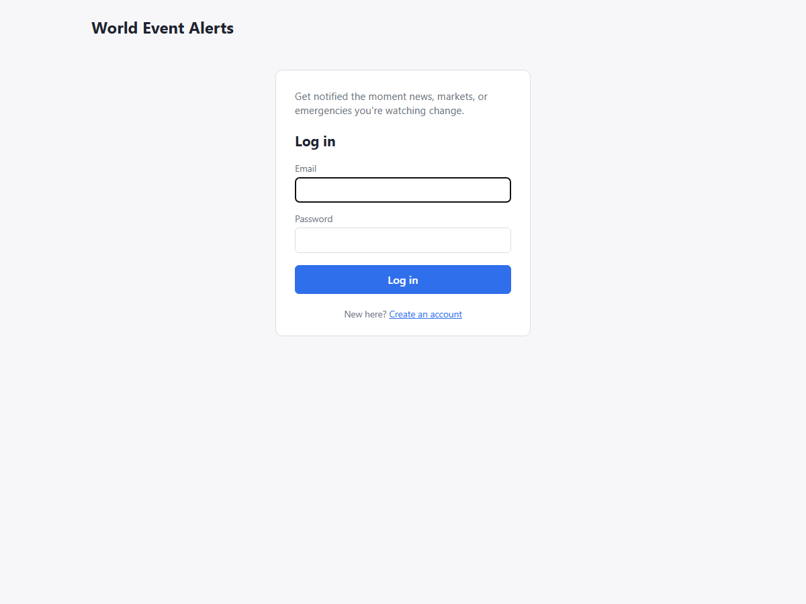
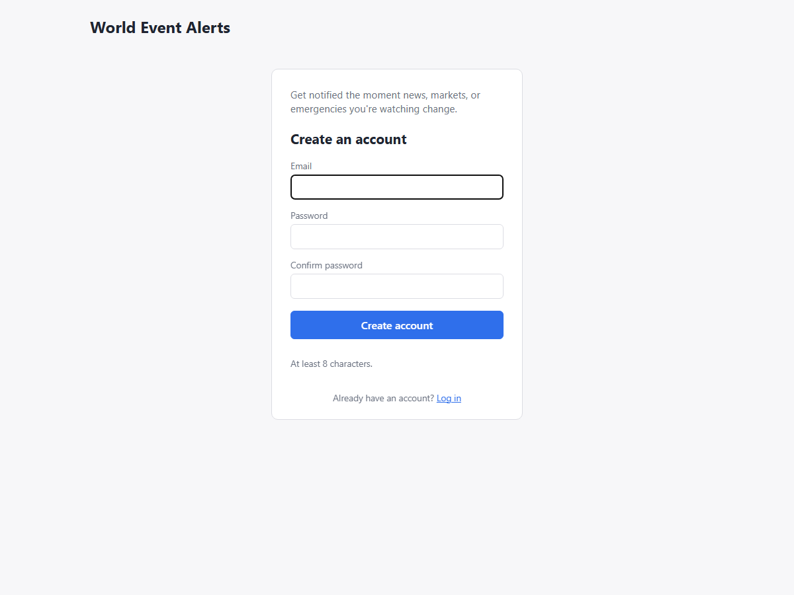
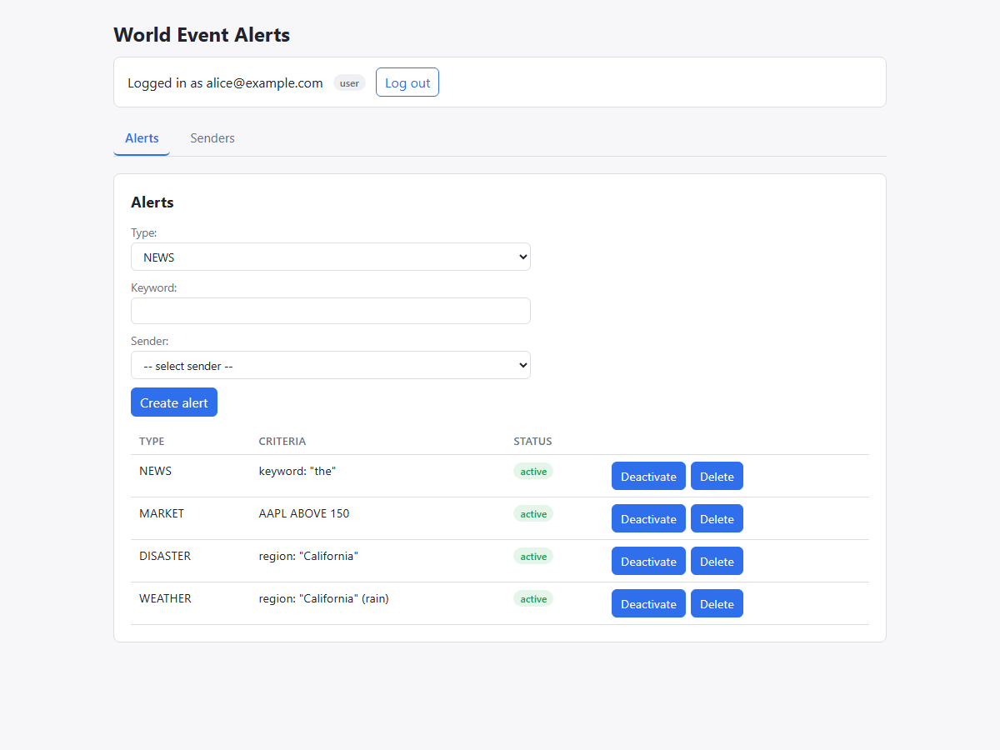
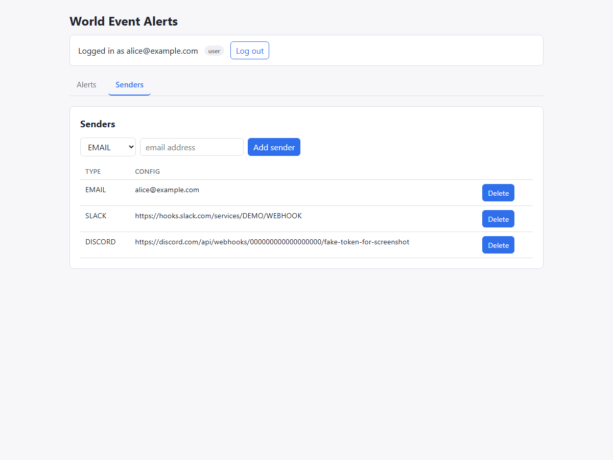
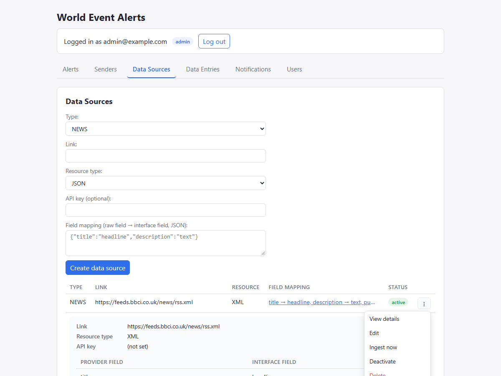
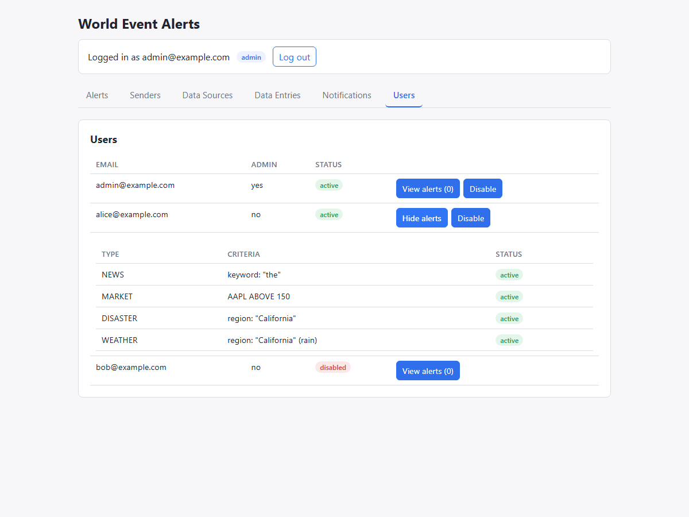
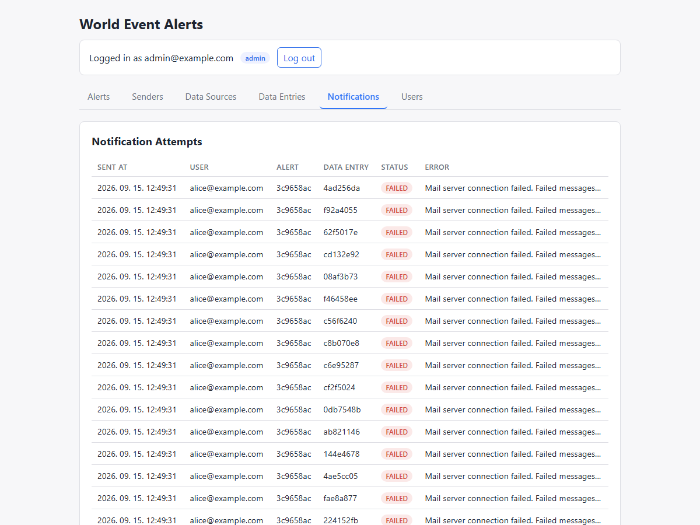
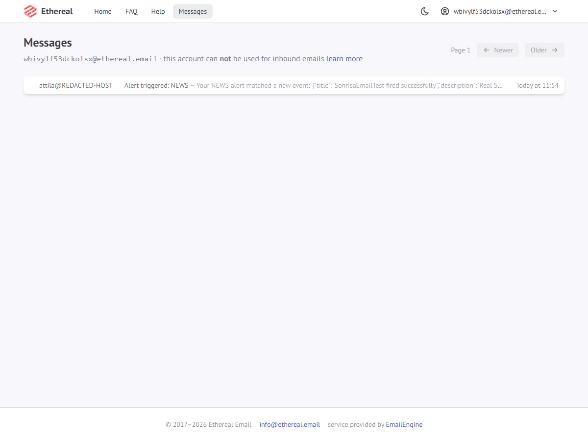
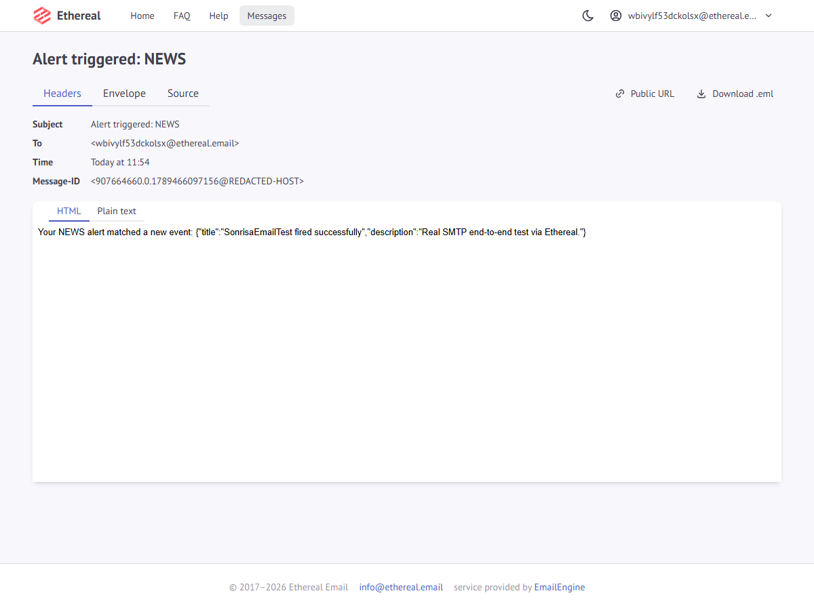
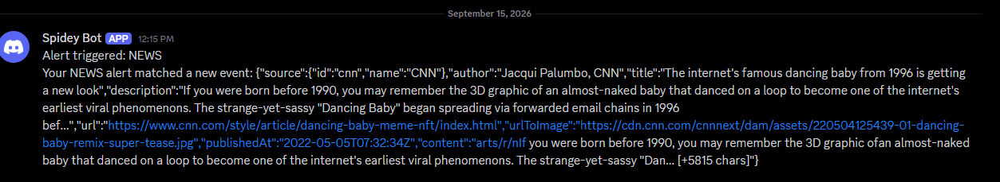

# World Event Alerts

A system that lets users subscribe to real-world events — breaking news, market moves, natural
disasters, weather — and get notified through a pluggable set of channels (email, Slack,
Discord) when something they care about happens.

## About this repository

This is a submission for **Task 4: Feature Design & Build from a Vague Brief** — an exercise in
using AI agents to take an intentionally underspecified brief to a working implementation,
evaluated on *how* the solution was reached, not just the end result.

Everything the submission checklist asks for lives directly in this repo:

| Asked for | Where |
|---|---|
| Commits per milestone, meaningful messages | `git log` on `master` |
| Prompt history | [`Working process.txt`](./Working%20process.txt) — every prompt and response summary, in order |
| Plans & decision logs | the multi-AI brainstorm comparison (`gemini/`, `deepseek/`, `genma/`, `sonnet/`, `comparison/`) and the three design docs below |
| Deliverables | [`SonrisaHomework/`](./SonrisaHomework) (backend) and [`frontend/`](./frontend) (frontend) |

## The brief

> "We want users to be able to set up alerts so they get notified when something important
> happens in the world — like breaking news, market movements, natural disasters, that kind of
> thing. Should work for both email and Slack. Make it flexible enough that we can add more
> channels later. We need an admin view too."

That's it — no wireframes, no schema, no agreement on what "something important" means, where
the data comes from, or how events get detected. The task: take this from ambiguity to a working
implementation, define an own plan of attack, and critically evaluate what the AI produced along
the way rather than accepting outputs at face value.

## Building process

### 1. Brainstorm

Rather than settling on one AI's read of the brief, it went through four models independently
before comparing them against each other:

- **Cloud-hosted:** Gemini (free tier), Claude Pro
- **Self-hosted:** DeepSeek Coder v2, Gemma via E2B

Each was asked to identify the key features implied by the brief, then produce an MVP summary in
its own words. DeepSeek was dropped after this phase — it consistently failed to follow the
requirements correctly, even after clarification. The other three converged on the same shape:

- a **user framework** (register, subscribe to data sources, set up triggers, manage them)
- **categorized, searchable data sources**
- **triggers** based on keyword/topic (and possibly importance)
- **pluggable connectors** to deliver alerts across multiple channels
- an **admin view** (data sources, manual trigger, health checks)

The AIs also surfaced the brief's central ambiguity: it never says whether "flexible enough to
add more channels later" should extend to the *data* side too (more event categories, more
providers per category), or just the *notification* side. The call made here was to design for
both — which is why the system ended up with two independent extension points (channel adapters
*and* typed source interfaces) instead of one.

### 2. Feature set (MVP)

The brainstorm output was reduced into [`mvp final.md`](./mvp%20final.md), scoped for a ~24-hour
build:

- **Users** — register/login (HTTP Basic — email + password, no SSO), subscribing to a topic
  *is* creating an alert, a delivery channel is chosen per alert, admin can enable/disable an
  account
- **Alerts** — three types, each with its own trigger logic: keyword match (news), value-change
  threshold (market), named-region match (location/disaster) — deferred: alert editing (delete +
  recreate instead), a generic field-engine that would let a type be defined by configuration
  alone
- **Notification channels** — a single `NotificationChannel.send(payload) → {status, error?}`
  contract, so a new channel is one new adapter and nothing else changes; delivery status is
  call-success only (did the provider's API accept it), not read/delivery confirmation
- **Data sources** — one typed interface per event category (News/Market/Emergency, Weather as a
  stretch goal), each exposing a fixed field set; a second *provider* within an existing category
  is a field-mapping exercise, not new code
- **Admin view** — a per-source event log, a mapping UI for adding a new data source, and a user
  list with enable/disable and alert visibility

Explicitly **out of scope** and noted as such rather than forgotten: a universal template engine
replacing the fixed typed interfaces, delivery/read confirmation beyond call-success, user-facing
alert history, roles beyond enabled/disabled, and dedup/digesting/quiet-hours/radius matching.

### 3. Data model

[`datamodel final.md`](./datamodel%20final.md) reduced six entities out of the four models'
proposals, sharing one `DataType` enum (`NEWS | MARKET | DISASTER | WEATHER`) across
`DataSource`, `DataEntry`, and `Alert` so the three stay linkable without string-matching:

```
User              { id, email, pw, isAdmin, isActive }
Sender            { id, type, user(FK), config }
DataSource        { id, type, link, apikey, fieldMapping, resourceType, isActive }
DataEntry         { id, type, dataSourceId(FK), rawJsonData, receivedAt }
Alert             { id, type, criteria, user(FK), sender(FK), isActive }
NotificationAttempt { id, alertId(FK), dataEntryId(FK), status, error, sentAt }
```

`NewsInterface` / `MarketInterface` / `EmergencyInterface` (and later `WeatherInterface`)
deliberately have no table of their own — they're built in memory at match time from
`DataEntry.rawJsonData` + `DataSource.fieldMapping`, not persisted.

### 4. Workflow

[`workflow.md`](./workflow.md) framed each entity as an explicit Create/Read/Update/
Deactivate/Delete table instead of assuming full CRUD everywhere — e.g. `User` has no update and
no delete (admin can only disable), `Alert`'s "delete" is really a deactivate that preserves
`NotificationAttempt` history, and `DataEntry` is immutable and append-only. That table is what
the backend's authorization and endpoint surface actually implements, entity by entity.

It also implied a build order — **User → DataSource → DataEntry (needs DataSource) → Alert
(needs User + Sender, independent of ingestion) → NotificationAttempt (needs Alert + DataEntry
both existing)** — which is roughly the order the backend was actually built in, milestone by
milestone, as logged in `Working process.txt`.

## Running it locally

```bash
# backend — http://localhost:8080
cd SonrisaHomework
./gradlew bootRun

# frontend — http://localhost:5173
cd frontend
npm install
npm run dev
```

The backend seeds one admin account on first boot (`admin@example.com` / `admin12345`) so the
admin views are reachable at all — there's no self-serve way to become an admin, matching the
brief's silence on how admin accounts get provisioned.

## Demo mode

Set `app.demo.enabled=true` (in `application.properties`, or
`./gradlew bootRun --args='--app.demo.enabled=true'`) to boot into a populated environment
instead of an empty one. Off by default — sample data has no business existing in a normal boot.

It seeds:

- **`alice@example.com` / `password123`** (active) — an email + Slack sender, one alert per type
- **`bob@example.com` / `password123`** (disabled) — demonstrates the enable/disable flow, and
  that a disabled account is rejected outright at login, not just at matching time
- The **two real NEWS providers** used throughout this project's own testing — the BBC News RSS
  feed (XML) and a CNN NewsAPI mirror (JSON) — same category, two different response shapes,
  doubling as a live demonstration of "a second provider is a mapping exercise, not new code"

No extra ingestion code is needed for the seeded sources to start producing data — the scheduled
job (`app.ingestion.interval-minutes`, floored at 2 minutes) picks up any active `DataSource` on
its own.

## Screenshots

**Walking through the app** — login/register are two distinct layouts, not one form relabeled by
a toggle; a regular user only ever sees their own Alerts/Senders, while admin gets the full
picture including data-source field mappings, the notification audit trail, and per-user alert
visibility:

| | |
|---|---|
|  |  |
|  |  |
|  |  |
|  | |

**Real delivery, not just a green checkmark** — every channel adapter was verified against a real
target, not just a mocked response:

- **Email**, via a throwaway Ethereal SMTP test inbox (no real credentials needed to verify the
  full send path):
  
  
- **Discord**, delivered into a real Discord server via a real webhook — proving the third
  channel adapter (written *after* the abstraction was already in place, as a deliberate test of
  it) genuinely required zero changes anywhere except one new adapter class:
  

## Future plans

Carried over from `mvp final.md`'s own deferred list, still genuinely open:

- **A universal template engine** — replacing the fixed typed source interfaces with a dynamic
  field system (typed filter operators per field) so a brand-new event category could be added
  via configuration alone, no new interface code. The open design question flagged at scoping
  time and still unresolved: how a "value-change" rule (which needs a *previous* value to compare
  against, not just a snapshot) fits into a generic field model.
- **Percent-change market comparator** — only absolute ABOVE/BELOW thresholds are implemented;
  percent-change needs the same previous-value question above settled first.
- **Delivery/read confirmation** beyond call-success status.
- **User-facing alert history**, and **roles beyond admin/enabled** (e.g. per-user rate limiting).
- **Dedup across ingestion runs** — re-polling the same feed currently re-creates `DataEntry`
  rows for articles already seen.
- **A real weather API** — the WEATHER alert type (region + rain) is implemented and tested, but
  only against manually-posted payloads; no working free/keyless weather API was found during
  this project. Wiring in a real one needs nothing beyond a `DataSource` row with the right
  `fieldMapping`.

Not in the original scope doc, surfaced by actually using the system:

- **Push updates instead of polling** — the frontend currently polls the two tabs the scheduler
  writes to every 15s; a WebSocket/SSE channel would make that instant instead of eventually
  consistent.
- **Per-source ingestion cadence** — one global interval covers every data source today; a
  fast-moving market feed and a daily digest feed can't be scheduled differently.
- **Password reset** and other account-recovery flows.
- **An explicit `From` address** for outbound email — it currently falls back to whatever the
  local machine/JVM derives, which is fine for testing but not for a real deployment.
